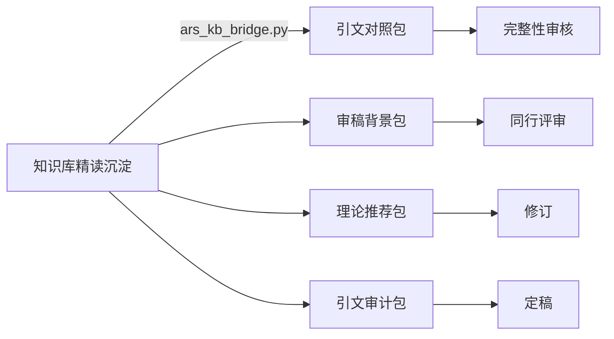

<div align="center">

# 🏛️ 公共管理科研知识库

**学术文献管理 + 系统综述 + AI 论文写作的工作流引擎**

[]()
[]()
[]()
[]()

将零散的 PDF 论文转化为结构化知识资产，从检索到纸上。  
覆盖 **社会学** · **公共管理学** · **老龄化研究** · **青少年研究** · **交叉研究** 五个方向。

</div>

---

## 📋 目录

- [项目背景](#项目背景)
- [架构特色：知识注入管线](#架构特色知识注入管线)
- [快速开始](#快速开始)
- [工作流：从采集到写作](#工作流从采集到写作)
- [项目规模](#项目规模)
- [目录结构](#目录结构)
- [技术栈](#技术栈)
- [分支说明](#分支说明)
- [版本历史](#版本历史)

---

## 项目背景

本知识库是一个将 **学术论文精读 → 跨篇沉淀 → AI 辅助论文写作** 全流程打通的个人研究基础设施。核心数据是 115 篇精读报告（全部 v10 完整格式），沉淀出覆盖 126 篇论文的摘要、524 个理论概念的交叉索引。

它解决的核心问题是：**当 AI 帮你写论文时，它能否真正基于你积累的知识？**

传统知识工具（Zotero、EndNote、Obsidian）的产出停在"给人看"，而 AI 写作工具又没有自己积累的知识可用。本项目在两者之间架设了一座桥。

---

## ⭐ 架构特色：知识注入管线



这不是 API 集成，而是 **Prompt 上下文注入模式（Knowledge Injection Pattern）**——每个 ARS 阶段启动前，将结构化知识翻译成 LLM 在该阶段最需要的输入格式，注入到 Agent 的上下文中。实现"审稿时拥有理论脉络、修订时能找到支撑文献、定稿时不做无根之木"。

📖 详细用法见 [`CLAUDE.md § 阶段 7`](CLAUDE.md)

---

## 快速开始

```bash
# 查看全景进度
python "14_工具脚本/pipeline.py" status

# 一键再生跨篇沉淀（提取→素材→日报→周报→月报）
python "14_工具脚本/提取/regenerate_all.py"

# 同步 Obsidian Vault（双向镜像）
python "14_工具脚本/tools/sync.py"

# == 论文写作 ==
# 研究启动器（从想法到原料包）
python "14_工具脚本/报告/research_starter.py" "研究想法" --direction 方向

# 论文终稿格式化（5 种中文学术模板）
python "14_工具脚本/report/create_formatted_docx.py" convert \
  -i 终稿.md -o 终稿_学报版.docx --style 学报
```

---

## 工作流：从采集到写作

### 第 1 步：采集

```plaintext
你 →
  老龄化方向很久没更新了，帮我搜索一下新论文。
我 →
  加载"老龄化"关键词池 → ncpssd 搜索 → 去重 → 下载 → 
  存入 01_论文原文/ → 更新检索日志 → 更新进度看板
```

支持多源通道：**ncpssd**（CSSCI 中文）、**arXiv**（英文预印本）、**OpenAlex**（开放索引）。自动去重（SQLite MD5 指纹），自动命名（年份_作者_标题.pdf）。

### 第 2 步：精读 ⭐

每篇论文按 `analysis_template.md`（v10 格式）逐篇分析，**175-205 行**，包含：

- **YAML frontmatter** — 9 字段元数据
- **论文信息表** — 期刊/DOI/基金/入库路径/MD5/CSSCI
- **研究概述** — 一句话定位 + 理论框架 + 方法
- **7 维质量评分** — 每维必须有评价性理由
- **内容拆解** — 核心发现 + 直接引文逐字匹配 + 核心概念定义
- **我的思考** — 最有启发的点 / 可借鉴 / 待验证 / 与我研究的关联

> ⚠️ **四个铁律**：不准简写 / 不准跳过审核 / 入库路径格式严格 / 存放目录与 PDF 一致

### 第 3 步：跨篇沉淀

`regenerate_all.py` 一键扫描全部精读报告：

| 产出 | 覆盖 | 说明 |
|:-----|:----:|:-----|
| 摘要素材 | 126 篇 | 各方向核心发现段聚合 |
| 理论交叉索引 | 524 个概念 | 理论框架段提取 + 引用频率统计 |
| 关键论点汇编 | 86 篇 | 跨篇引用行聚合，带来源标注 |
| 研究空白 | 124 篇 | 不足与展望段聚合 → 选题原料 |

### 第 4 步：论文写作（知识注入模式）

> 这是区分于普通 ARS 使用方式的关键——**你的每一步都植入了知识库积累**。

```plaintext
你：
请帮我审核这篇论文初稿。
路径：10_研究输出/_papers/你的论文/01_初稿/初稿.docx

我（第1步）：
读论文 → 判断方向 → ars_kb_bridge.py stage-3 
→ 审稿背景包注入 → 输出5份审稿报告

你：
请做引文审计。

我（第2步）：
提取引文 → ars_kb_bridge.py stage-5 
→ 引文审计包 → 输出已引用vs漏引对照表

你：
请给出修订方案。

我（第3步）：
综合审稿+引文审计 → 输出修订方案
```

📌 各阶段知识包通过 `--paper` 参数自动归档到 `10_研究输出/_papers/`。

### 第 5 步：报告产出

- 日报：今日新报告 + 评分排序 + 明日计划
- 周报：本周进展 + 方向缺口 + 方法建议
- 月报：资产盘点 + 健康评估 + 研究空白趋势

---

## 项目规模

| 方向 | PDF | 精读 | v10 | 沉淀 |
|:-----|:---:|:----:|:---:|:----:|
| 公共管理学 | 31 | 31 | ✅ | ✅ |
| 社会学 | 47 | 47 | ✅ | ✅ |
| 老龄化 | 25 | 25 | ✅ | ✅ |
| 青少年研究 | 2 | 2 | ✅ | ✅ |
| 交叉研究 | 10 | 10 | ✅ | ✅ |
| **总计** | **115** | **115** | ✅ | **126 篇** |

**已产出论文**：《技术在场、服务缺席——数智养老服务中数字排斥的生成逻辑与治理路径》（13,135 字，已通过 ARS 全流程管线）

---

## 目录结构

```
D:\公共管理科研\
├── 01_论文原文\          # PDF 原文（按方向分目录，115 篇）
├── 02_精读报告\          # ⭐核心产出（v10 完整格式，含索引）
├── 03_学术写作素材库\    # ⭐跨篇沉淀（摘要·理论·论点·空白）
├── 04_研究方法\         # 方法笔记（9 篇）
├── 05_报告\             # 日/周/月报自动生成
├── 10_研究输出\         # ⭐论文写作产物
│   ├── README.md        # 总索引
│   ├── _papers/         # 论文按文件夹分组
│   │   ├── 技术在场服务缺席/
│   │   │   ├── 01_初稿/ → 06_定稿/ （完整 ARS 6 阶段）
│   │   └── 智慧养老研究发展态势分析/
│   │       └── ...（同模板）
│   └── 原料包/           # 研究启动报告
├── 14_工具脚本\          # ⭐全部工具集中管理
│   ├── pipeline.py       # 统一仲裁器
│   ├── 采集/             # ncpssd / arXiv / OpenAlex
│   ├── 入库/             # Zotero 批量导入
│   ├── 报告/             # 日报/周报/月报/ARS桥接
│   ├── 提取/             # 跨篇沉淀
│   └── 检查推送.py       # pre-push hook
├── ObsidianVault\        # 知识库 Obsidian 镜像
│   ├── 01_论文精读\      # 115 篇 + 索引
│   └── 03_写作素材\      # 摘要/理论/论点/空白
└── config\               # 配置
    └── areas.yaml        # 领域关键词（换领域改这里）
```

---

## 技术栈

| 工具 | 用途 |
|:-----|:------|
| [Python 3.11+](https://python.org) | 所有脚本运行环境 |
| [Zotero](https://zotero.org) | 可选归档后端 |
| [Obsidian](https://obsidian.md) | 知识库图谱 + 查询 |
| [arXiv API](https://info.arxiv.org) | 英文预印本 |
| [OpenAlex API](https://docs.openalex.org) | 开放学术索引 |
| [academic-research-skills](https://github.com/Imbad0202/academic-research-skills) | 论文写作管线 |

**致谢**：本项目的论文写作架构借鉴了 [academic-research-skills](https://github.com/Imbad0202/academic-research-skills)（MIT License）和 [evil-read-arxiv](https://github.com/juliye2025/evil-read-arxiv)（MIT License）的优秀设计。

---

## 分支说明

| 分支 | 内容 | 适用场景 |
|:-----|:-----|:---------|
| **master** | 完整知识库（115 精读 + 工具 + 论文） | 你的日常研究 |
| **framework** | 纯技能框架（skills/ + config/，无知识内容） | 换领域使用 |

切换到 framework 分支并修改 `config/areas.yaml` 即可用于任何学科。

---

## 版本历史

| 版本 | 日期 | 要点 |
|:----:|:----:|:------|
| **v10.5** | 2026-06-10 | 全量对齐（115=115）· 知识注入管线 · pre-push hook · 归档标准化 |
| **v10.4** | 2026-06-10 | 19 篇缺口补齐 · 工作经验固化 |
| **v10.3** | 2026-06-10 | 自检机制 · Agent 角色映射 · 文件名标准化 |
| v1~v9 | 2026-04~06 | 前期建设与迭代 |

---

<div align="center">

**知识不只为人类阅读，也为 AI 写作时可用。**

</div>
